# Command flow

Every slash command Muster registers, and what each one does step by step. The diagrams follow the code, not the design documents, so they show what runs today. Where a judgment call site or a controller exists but nothing calls it yet, the diagram marks it as not wired.

Sources: [dispatcher](../src/change/dispatch.ts), [command table](../src/change/commands.ts), [action resolver](../src/controller/action-resolver.ts), [snapshot](../src/controller/change-snapshot.ts), [planning phase](../src/change/phases/planning.ts), [review phase](../src/change/phases/review.ts), [implementation phase](../src/change/phases/implementation.ts), [verification phase](../src/change/phases/verification.ts), [finish phase](../src/change/phases/finish.ts). For what leaves the machine at each judgment call site, see the [security model](security.md).

Contents:

1. [Command surface](#1-command-surface)
2. [Dispatch pipeline](#2-dispatch-pipeline)
3. [Lifecycle](#3-lifecycle)
4. [Explore](#4-explore)
5. [Propose and refine](#5-propose-and-refine)
6. [Review](#6-review)
7. [Implement and resume](#7-implement-and-resume)
8. [One task through the pipeline](#8-one-task-through-the-pipeline)
9. [Verify](#9-verify)
10. [Finish](#10-finish)
11. [Status](#11-status)
12. [Judgment runtime](#12-judgment-runtime)
13. [Legacy and Fusion commands](#13-legacy-and-fusion-commands)

How to read the colors: [How to read the diagrams](#how-to-read-the-diagrams).

## How to read the diagrams

Two colors mark cost and outside calls. Everything uncolored is deterministic code that spends no tokens.

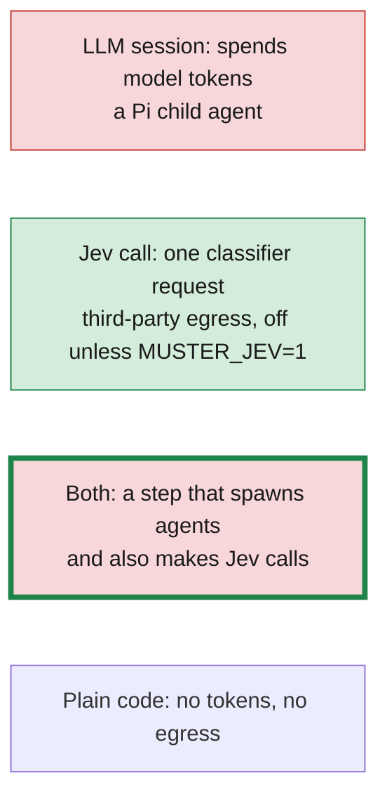

Red is an LLM session and green is a Jev call. A red node with a thick green border is a step that contains both, used in the overview diagrams where the individual calls are not drawn. Two Jev decisions, `context.capsule_ranking` and `debugging.thrash`, are built but not called anywhere, so they never appear in green.

Of the nine `/change` commands, `verify`, `finish` and `status` spend no tokens. `verify` runs nine deterministic gates and the test commands, and no agent is dispatched. The where-the-tokens-go breakdown and ways to reduce it are in [simplification.md](simplification.md).

## 1. Command surface

`registerMuster` in [src/muster/index.ts](../src/muster/index.ts) registers the `/change` command and the flags it reads from one entry point.

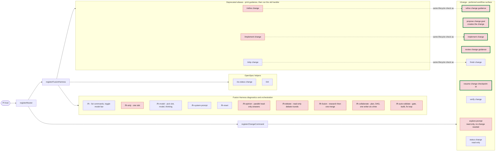

## 2. Dispatch pipeline

Every `/change` invocation runs this path. Only the handler differs between subcommands. The per-action flags come from [commands.ts](../src/change/commands.ts).

| Action | Argument shape | Change slug | Lifecycle gated | Read-only | Run identity |
| --- | --- | --- | --- | --- | --- |
| `explore` | free text (at least 1 word) | none | no | yes | none |
| `propose` | change + text | optional | no | no | per invocation |
| `refine` | change + text | required | yes | no | per invocation |
| `review` | change + text | required | yes | no | per invocation |
| `implement` | change only | required | yes | no | per change |
| `verify` | change only | required | yes | no | per change |
| `finish` | change only | required | yes | no | per change |
| `status` | change only | required | yes | yes | none |
| `resume` | change + exactly one checkpoint id | required | yes | no | per change |

## 3. Lifecycle

The controller derives a change's lifecycle from a `ChangeSnapshot`, never from anything a model reports. The command's allowed lifecycles are in [action-resolver.ts](../src/controller/action-resolver.ts).

| Command | Allowed lifecycles |
| --- | --- |
| `explore`, `propose`, `status` | any |
| `refine` | `PLANNING`, `REVIEW_REQUIRED`, `DESIGN_CONFLICT`, `BLOCKED` |
| `review` | `REVIEW_REQUIRED` |
| `implement` | `READY`, `IMPLEMENTING` |
| `resume` | `AWAITING_USER` |
| `verify` | `VERIFYING` |
| `finish` | `VERIFIED` |

When a command is refused, the "next" command comes from the current lifecycle: `PLANNING` and `DESIGN_CONFLICT` suggest `refine`, `REVIEW_REQUIRED` suggests `review`, `READY` and `IMPLEMENTING` suggest `implement`, `AWAITING_USER` suggests `resume`, `VERIFYING` suggests `verify`, `VERIFIED` suggests `finish`, and everything else suggests `status`.

### Derivation order

`deriveLifecycle` checks these in order and returns the first that matches.

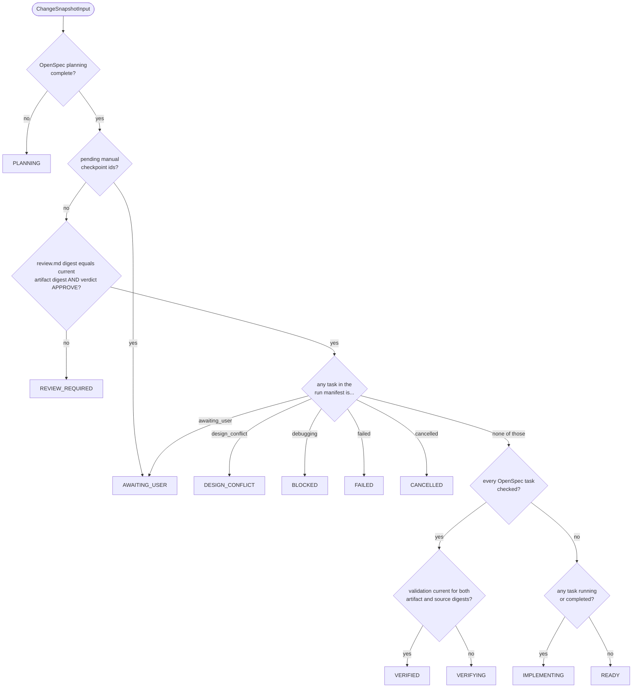

### Transitions

Any non-terminal state can also move to `CANCELLED`. `FINISHING` and `COMPLETE` are in the transition table, but `deriveLifecycle` never returns them, because an archived change is no longer observable. `AWAITING_USER`, `DESIGN_CONFLICT`, `BLOCKED`, `FAILED` and `CANCELLED` are tracked per task and DAG branch, so unrelated branches keep running.

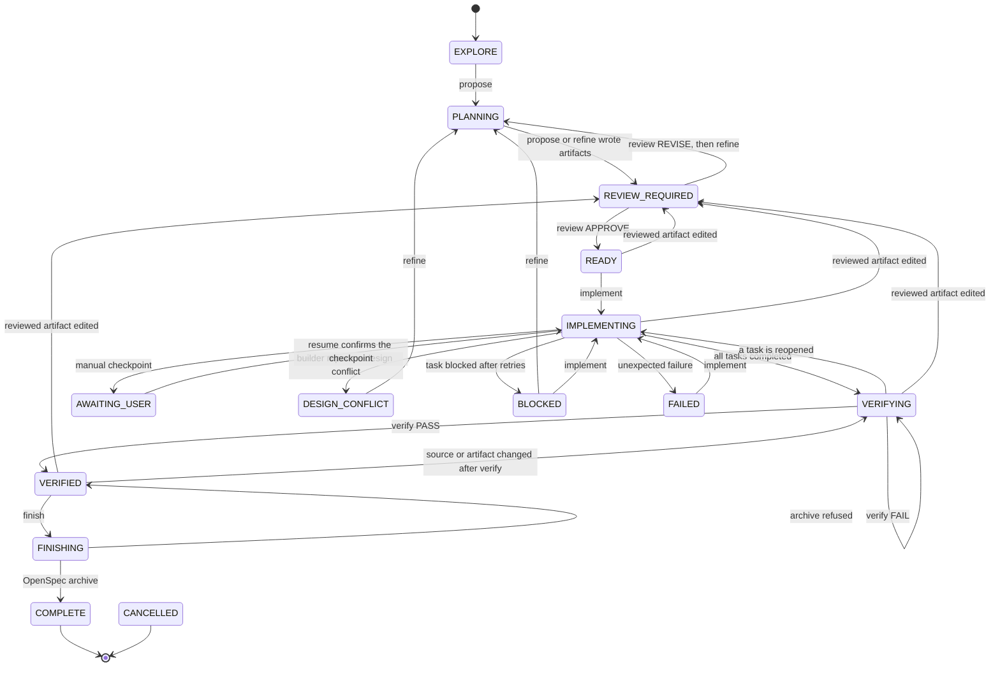

## 4. Explore

`/change explore <prompt>` investigates without creating a change or touching the lifecycle. It needs no OpenSpec change and no healthy snapshot.

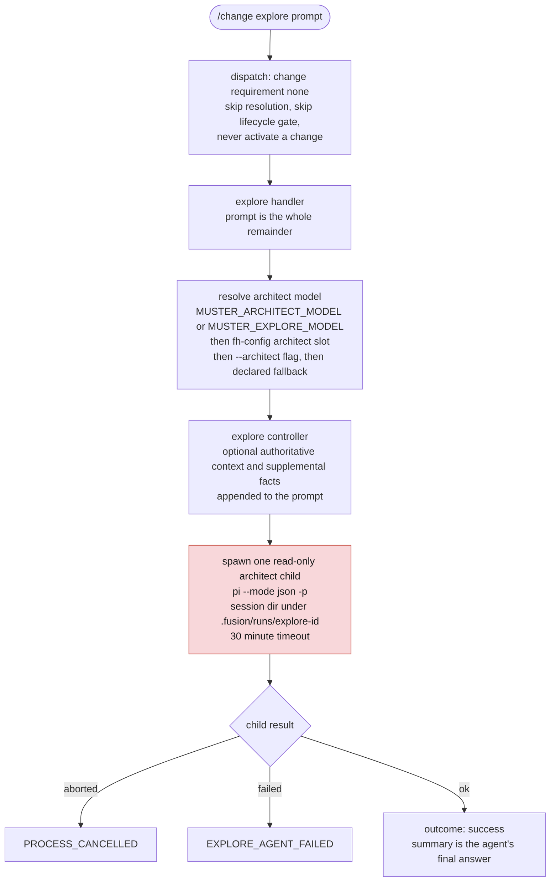

## 5. Propose and refine

`/change propose <change> <goal>` creates a change and its planning artifacts. `/change refine <change> [guidance]` revises them. Both call `runProductionPlanning` with a different phase.

```mermaid
flowchart TD
  a(["/change propose or refine"]) --> gate{"phase"}
  gate -- "propose (not lifecycle gated)" --> pre
  gate -- "refine (PLANNING, REVIEW_REQUIRED,<br/>DESIGN_CONFLICT or BLOCKED)" --> early["fetch OpenSpec status early<br/>read review.md"]
  early --> rev{"latest verdict<br/>REVISE?"}
  rev -- yes --> fold["fold required changes and critical<br/>findings into the request text"]
  rev -- no --> pre
  fold --> pre

  pre["planning budget<br/>default 1,000,000 tokens and 1.50 USD<br/>MUSTER_PLANNING_MAX_TOKENS, MUSTER_PLANNING_MAX_COST_USD<br/>or --planning-max-tokens, --planning-max-cost"] --> jrt["create judgment runtime from the environment"]

  jrt --> jp{"judgment enabled?"}
  jp -- no --> agentPre
  jp -- yes --> cand["retrieve up to 10 candidate files by code<br/>600 byte excerpts, denylisted files excluded"]
  cand --> judgePre["judge planning.preflight<br/>disposition plus per-candidate relevance"]
  judgePre --> acted{"enforce mode<br/>and confident?"}
  acted -- yes --> compose["compose preflight from the judgment<br/>no agent runs, avoided cost recorded"]
  acted -- no --> agentPre

  agentPre["budget forecast for preflight<br/>blocked_mandatory throws BUDGET_EXHAUSTED"] --> pchild["bounded read-only architect child<br/>brokered tools, at most 6 read/search calls, low thinking<br/>candidates pre-loaded only in enforce mode that did not act"]
  pchild --> pparse["parsePreflight<br/>exactly one JSON object with disposition,<br/>summary, evidence paths, optional question"]
  compose --> disp
  pparse --> recon["reconcile record: which path produced it,<br/>agreement and evidence overlap in shadow mode"]
  recon --> disp{"disposition"}

  disp -- needs_clarification --> blockQ["outcome: blocked<br/>next is the specific question"]
  disp -- already_satisfied --> blockS["outcome: blocked<br/>evidence listed, asks which branch or entry point still fails"]
  disp -- proceed --> ph{"phase"}

  ph -- propose --> exists{"OpenSpec knows<br/>this change?"}
  exists -- no --> create["install fusion-driven schema if missing<br/>openspec create change with that schema"]
  exists -- yes --> st
  create --> st["OpenSpec status and artifact instructions<br/>for proposal, specs, design, tasks"]
  ph -- refine --> st

  st --> risk["resolve risk inputs<br/>pattern baseline for contract, migration,<br/>security boundary, design ambiguity"]
  risk --> jc{"judgment enabled?"}
  jc -- yes --> judgeC["judge planning.complexity"]
  judgeC --> merge["enforce and confident: replace pattern inputs<br/>otherwise keep the pattern values<br/>reconcile agreement with pattern"]
  jc -- no --> classify
  merge --> classify["classifyChange<br/>file count 2 or fewer low, up to 8 medium, more high<br/>capabilities 1 low, 2 medium, 3 or more high<br/>migration, security, ambiguity are high<br/>public contract is medium"]

  classify --> cls{"classification"}
  cls -- "direct (thinking low)" --> minimal
  cls -- "bounded (thinking medium)" --> minimal
  cls -- "architectural (configured thinking)" --> opt
  minimal["minimal route<br/>synthesis only"] --> synthF
  opt["forecast specialist opinions<br/>two or more parallel read-only children,<br/>one per builder slot in rotation"] --> optB{"optional budget<br/>available?"}
  optB -- no --> skipped["optional_skipped_budget<br/>synthesis only"]
  optB -- yes --> debate["forecast then run one debate child<br/>reads all opinions"]
  skipped --> synthF
  debate --> synthF

  synthF["mandatory synthesis budget forecast<br/>blocked_mandatory throws BUDGET_EXHAUSTED"] --> synth["synthesis child returns one JSON bundle<br/>proposal.md, design.md, specs/capability/spec.md, tasks.md"]
  synth --> write["writeArtifacts"]
  write --> v1["parse bundle, reject duplicate paths,<br/>reject paths outside the change root,<br/>require proposal, design, tasks and one capability spec"]
  v1 --> tq["assessTaskQuality: judge planning.task_quality<br/>only when judgment is enabled and tasks.md parses<br/>with at most 40 tasks, advice only"]
  tq --> files["write files to openspec/changes/change"]
  v1 -. "invalid bundle" .-> retry{"attempt below 2?"}
  retry -- yes --> resynth["synthesis again with the rejection reason<br/>fed back and a JSON escaping reminder"]
  resynth --> write
  retry -- no --> fail["PLANNING_ARTIFACT_INVALID"]
  files --> done["outcome: success<br/>task quality findings listed when enforce mode produced any<br/>next: /change review change"]
  classDef llm fill:#f8d7da,stroke:#c0392b,color:#1a1a1a
  classDef jev fill:#d4edda,stroke:#1e8449,color:#1a1a1a
  classDef llmJev fill:#f8d7da,stroke:#1e8449,stroke-width:4px,color:#1a1a1a
  class judgePre,judgeC,tq jev
  class pchild,opt,debate,synth,resynth llm
```

Each planning child records a usage entry in the change's run store, and the budget ledger is updated whether or not the child succeeded.

## 6. Review

`/change review <change> [guidance]` runs an independent, fresh-context planning review over the proposal, specs, design and tasks. It is only allowed in `REVIEW_REQUIRED`.

```mermaid
flowchart TD
  a(["/change review change guidance"]) --> g["lifecycle gate: REVIEW_REQUIRED only"]
  g --> setup["OpenSpec status, model stack, run id,<br/>usage store, judgment runtime"]
  setup --> tflag{"judgment enabled AND<br/>MUSTER_JEV_REVIEW_TRIAGE=1?"}
  setup --> notes{"judgment enabled?"}
  notes -- yes --> qn["read tasks.md, load still-current<br/>task quality notes from plan time"]
  notes -- no --> disc
  qn --> disc
  tflag --> disc["discover reviewed artifacts<br/>hash them into the artifact digest<br/>read existing review.md if any"]

  disc --> tri{"triage enabled?"}
  tri -- no --> disp
  tri -- yes --> capture["capture reviewed set:<br/>per-file digests, proposal text, design text"]
  capture --> assess["assessReviewTriage: judge review.triage<br/>only if: existing review is APPROVE,<br/>no guidance given, a retained copy exists,<br/>specs and tasks unchanged<br/>sends unified diffs of proposal and design"]
  assess --> carry{"immaterial edit, confident,<br/>and fewer than 3 carry-forwards in a row?"}
  carry -- no --> disp
  carry -- yes --> recheck{"artifact digest still<br/>the same?"}
  recheck -- no --> disp
  recheck -- yes --> carried["write review.md: APPROVE carried forward<br/>round plus 1, names basis digest, count, judged answers<br/>no reviewer runs"]
  carried --> okOut

  disp["dispatchPlanningReview<br/>fresh reviewer session, a model other than the<br/>author's preferred, else the same model,<br/>read tools only, brokered planning reviewer child"] --> parsed{"reviewer output is valid<br/>structured verdict?"}
  parsed -- yes --> after
  parsed -- no --> extract["judge review.extraction<br/>classify candidate lines of the reviewer prose<br/>extraction marked in review.md"]
  extract --> after["verdict APPROVE or REVISE<br/>critical findings, required changes, recommendations"]
  after --> same{"artifact digest unchanged<br/>while the reviewer ran?"}
  same -- no --> stale["REVIEW_ARTIFACT_INVALID"]
  same -- yes --> wr["write review.md<br/>round, model, artifact digest, verdict"]
  wr --> trecon{"triage enabled?"}
  trecon -- yes --> tr["reconcile triage record<br/>on APPROVE retain the approved set<br/>at most 3 retentions per change"]
  trecon -- no --> verdict
  tr --> verdict{"verdict"}
  verdict -- APPROVE --> okOut["outcome: success<br/>lifecycle becomes READY<br/>next: /change implement change"]
  verdict -- REVISE --> revise["outcome: blocked<br/>required changes listed<br/>next: /change refine change<br/>refine folds them into its prompt automatically"]
  classDef llm fill:#f8d7da,stroke:#c0392b,color:#1a1a1a
  classDef jev fill:#d4edda,stroke:#1e8449,color:#1a1a1a
  classDef llmJev fill:#f8d7da,stroke:#1e8449,stroke-width:4px,color:#1a1a1a
  class assess,extract jev
  class disp llm
```

## 7. Implement and resume

`/change implement <change>` compiles `tasks.md` into a dependency DAG and runs dependency-ready tasks in a dedicated worktree. `/change resume <change> <checkpoint-id>` confirms a pause and then runs the same flow.

```mermaid
flowchart TD
  a(["/change implement change"]) --> g["lifecycle gate: READY or IMPLEMENTING"]
  r(["/change resume change checkpoint-id"]) --> rg["lifecycle gate: AWAITING_USER<br/>exactly one argument"]
  g --> load
  rg --> load

  load["OpenSpec status and apply instructions<br/>hash reviewed artifacts<br/>load and validate tasks.md"] --> tv{"every checkbox has a valid<br/>harness-task metadata block?"}
  tv -- no --> tinv["TASK_DOCUMENT_INVALID or TASK_METADATA_INVALID"]
  tv -- yes --> dag["compile task DAG from dependsOn<br/>persist under the change run store"]
  dag --> wt["ensureChangeWorktree<br/>path: sibling .muster-worktrees/repo/change-slug<br/>branch: muster/change-slug from the planning HEAD<br/>reuse only if branch and repository identity match"]
  wt --> man{"run manifest exists?"}
  man -- yes --> idc{"manifest change, repository and<br/>worktree match the selection?"}
  idc -- no --> conflict["RECOVERY_STATE_CONFLICT"]
  idc -- yes --> chg{"artifact digest differs<br/>from the manifest's?"}
  man -- no --> newm["write manifest: lifecycle READY,<br/>tasks ready or completed,<br/>model assignments, worktree identity"]
  newm --> chg
  chg -- yes --> inval["recovery action invalidate_run"]
  chg -- no --> pend["recovery actions restore_checkpoint<br/>for each pending checkpoint"]

  inval --> flow
  pend --> flow{"which command?"}
  flow -- implement --> impl["implementChange<br/>runPreparedFlow"]
  flow -- resume --> found{"checkpoint id is pending<br/>in this run?"}
  found -- no --> badresume["MANUAL_RESUME_INVALID"]
  found -- yes --> confirm["confirmManualCheckpoint<br/>records who confirmed and when"]
  confirm --> impl2["runPreparedFlow with that checkpoint<br/>removed from the pending list"]

  impl --> rf
  impl2 --> rf["runImplementationFlow"]
  rf --> rec["run recovery actions"]
  rec --> fresh{"review current AND<br/>no invalidate_run action?"}
  fresh -- no --> rreq["status review_required<br/>next: /change review change"]
  fresh -- yes --> ronly{"recovery-only actions left?<br/>wait for child or lease, review existing changes,<br/>resume task review, synchronize completion"}
  ronly -- yes --> paused0["status paused"]
  ronly -- no --> sch["runChangeScheduler<br/>see section 8 for each task"]

  sch --> res{"scheduler states"}
  res -- "any design_conflict" --> dc["persist design_conflict on those tasks<br/>status design_conflict"]
  res -- "all completed" --> comp["status completed"]
  res -- "any awaiting_user" --> pau["status paused"]
  res -- otherwise --> blk["status blocked"]
  sch -. "any cancelled" .-> canc["manifest lifecycle CANCELLED"]

  comp --> mf["manifest lifecycle VERIFYING<br/>outcome: success<br/>next: /change verify change"]
  dc --> mf2["manifest lifecycle DESIGN_CONFLICT<br/>outcome: blocked<br/>next: /change refine change"]
  pau --> mf3["manifest lifecycle AWAITING_USER<br/>outcome: blocked, pending checkpoint kind<br/>next: /change resume change checkpoint-id"]
  blk --> mf4["manifest lifecycle BLOCKED<br/>outcome: blocked<br/>next: /change status change"]
  rreq --> out5["outcome: blocked, stale digest"]
  classDef llm fill:#f8d7da,stroke:#c0392b,color:#1a1a1a
  classDef jev fill:#d4edda,stroke:#1e8449,color:#1a1a1a
  classDef llmJev fill:#f8d7da,stroke:#1e8449,stroke-width:4px,color:#1a1a1a
  class sch llmJev
```

The scheduler runs at most one writing task at a time under a writer lease and lets read-only tasks run alongside. A task that throws is attempted a second time; see section 8 for what counts as a retry.

## 8. One task through the pipeline

This is the `execute` callback the scheduler runs for each dependency-ready task, in [implementation.ts](../src/change/phases/implementation.ts) and [task-runner.ts](../src/execution/task-runner.ts).

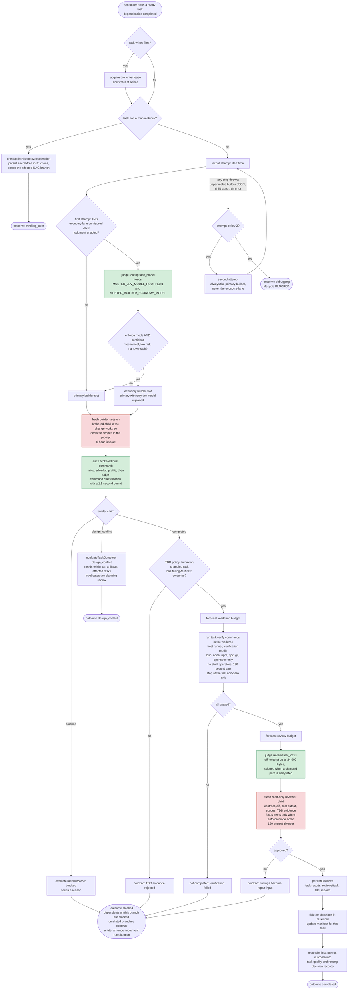

A task gets a second attempt only when an attempt throws. A returned `blocked` outcome (the builder claimed it, TDD evidence was rejected, verification failed, or the reviewer asked for repair) is final for that run: it blocks the task's dependents and leaves everything else running. Two thrown attempts end in `debugging`, which the snapshot derives as `BLOCKED`.

Two judgment call sites are built but not connected to task execution yet, so nothing is sent for them: `context.capsule_ranking` (context capsule assembly) and `debugging.thrash` (the repair loop that records failures). The [security model](security.md) lists both with that caveat.

## 9. Verify

`/change verify <change>` runs fresh-context final verification. It is only allowed in `VERIFYING`, which is the state after every task is checked and before a current validation exists. No agent runs here: `runFinalValidation` opens a fresh session identity but every gate is a code collector, so this command spends no tokens. It only runs the test commands.

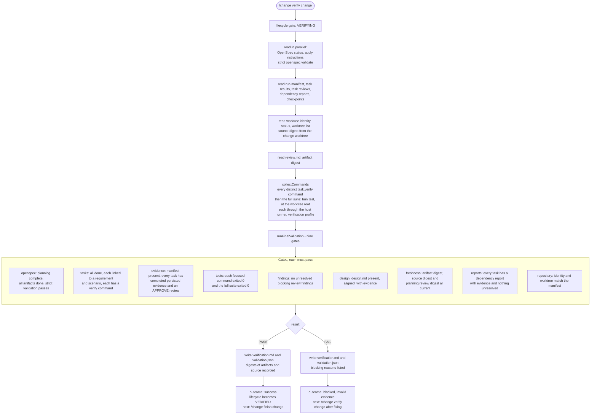

## 10. Finish

`/change finish <change>` never runs automatically after verification. It confirms the recorded verification is still current and hands archiving to OpenSpec.

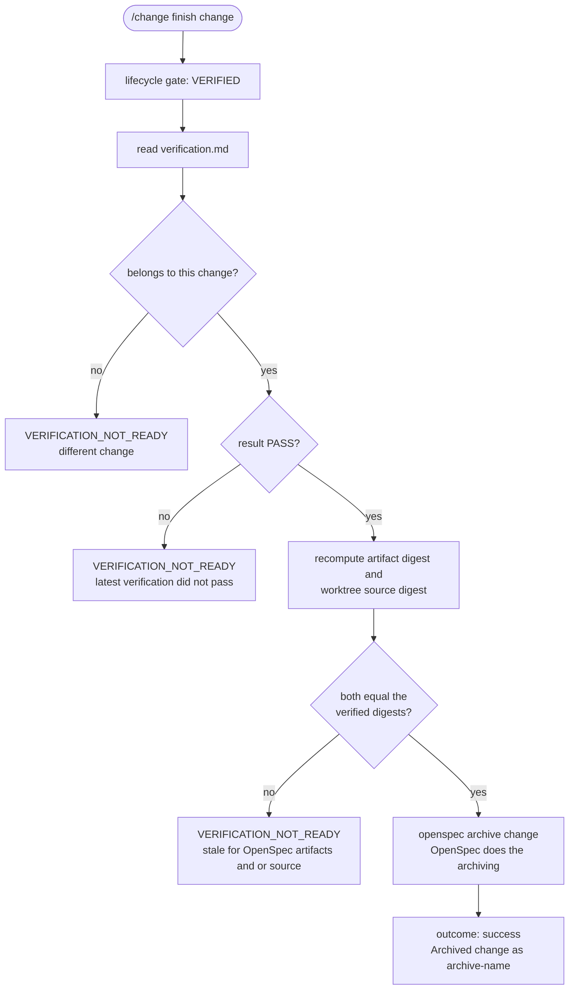

Archiving does not merge the change branch. The implementation stays on `muster/<change>` in the sibling worktree until you merge or discard it.

## 11. Status

`/change status [change]` is read-only. It does not remember the change as active.

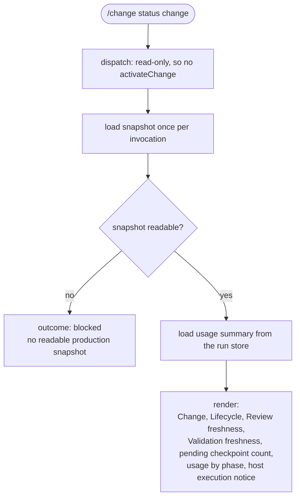

## 12. Judgment runtime

Every judgment call site goes through the same runtime in [src/judgment/ask.ts](../src/judgment/ask.ts). With judgment off, nothing is sent and behavior is exactly what it is without it.

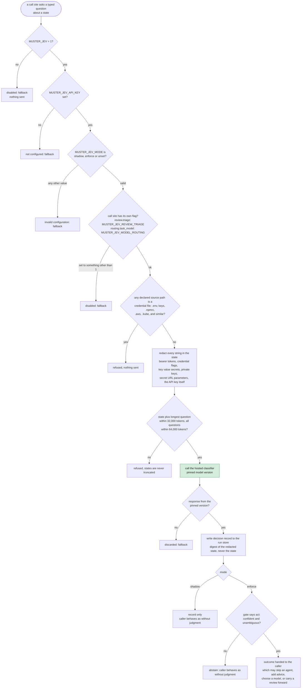

The call sites, in the order they fire during a change:

| Order | Decision | Where | Can change behavior in enforce mode |
| --- | --- | --- | --- |
| 1 | `planning.preflight` | propose, refine | yes: skips the preflight agent |
| 2 | `planning.complexity` | propose, refine | yes: replaces pattern risk inputs |
| 3 | `planning.task_quality` | propose, refine, before writing artifacts | no: advice only |
| 4 | `review.triage` | review, needs its own flag | yes: can carry an approval forward |
| 5 | `review.extraction` | review, only for unstructured reviewer output | yes: extracts findings |
| 6 | `routing.task_model` | implement, first attempt, needs its own flag | yes: picks the economy lane |
| 7 | `command.classification` | implement, every brokered host command | yes: a non-none category denies the command |
| 8 | `review.task_focus` | implement, before each task review | no: adds focus to the reviewer prompt |
| - | `context.capsule_ranking` | not connected | - |
| - | `debugging.thrash` | not connected | - |

## 13. Legacy and Fusion commands

These commands were retired and are no longer registered. The diagram below is kept until the documentation refresh in the last change of the simplification series replaces it.

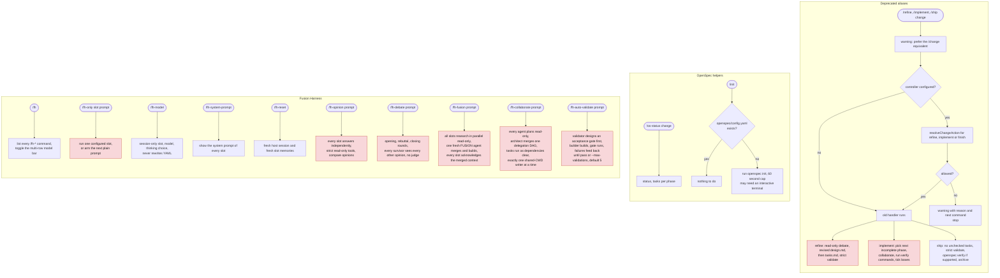
