# Command flow

The one slash command Muster registers, `/change`, and what each of its nine actions does step by step. The diagrams follow the code, not the design documents, so they show what runs today, including the three lanes (`small`, `medium`, `large`) that decide how much of the pipeline a change gets.

Sources: [dispatcher](../src/change/dispatch.ts), [command table](../src/change/commands.ts), [action resolver](../src/controller/action-resolver.ts), [snapshot](../src/controller/change-snapshot.ts), [planning](../src/planning/run.ts), [planning phase](../src/change/phases/planning.ts), [plan review](../src/controller/plan-review.ts), [review phase](../src/change/phases/review.ts), [implementation phase](../src/change/phases/implementation.ts), [verification phase](../src/change/phases/verification.ts), [finish phase](../src/change/phases/finish.ts). For what leaves the machine at each judgment call site, see the [security model](security.md).

Contents:

1. [Command surface](#1-command-surface)
2. [Dispatch pipeline](#2-dispatch-pipeline)
3. [Lifecycle](#3-lifecycle)
4. [Explore](#4-explore)
5. [Propose and refine](#5-propose-and-refine)
6. [Review](#6-review)
7. [Implement and resume](#7-implement-and-resume)
8. [One task through the pipeline](#8-one-task-through-the-pipeline)
9. [Verify](#9-verify)
10. [Finish](#10-finish)
11. [Status](#11-status)
12. [Judgment runtime](#12-judgment-runtime)

How to read the colors: [How to read the diagrams](#how-to-read-the-diagrams).

## How to read the diagrams

Two colors mark cost and outside calls. Everything uncolored is deterministic code that spends no tokens.

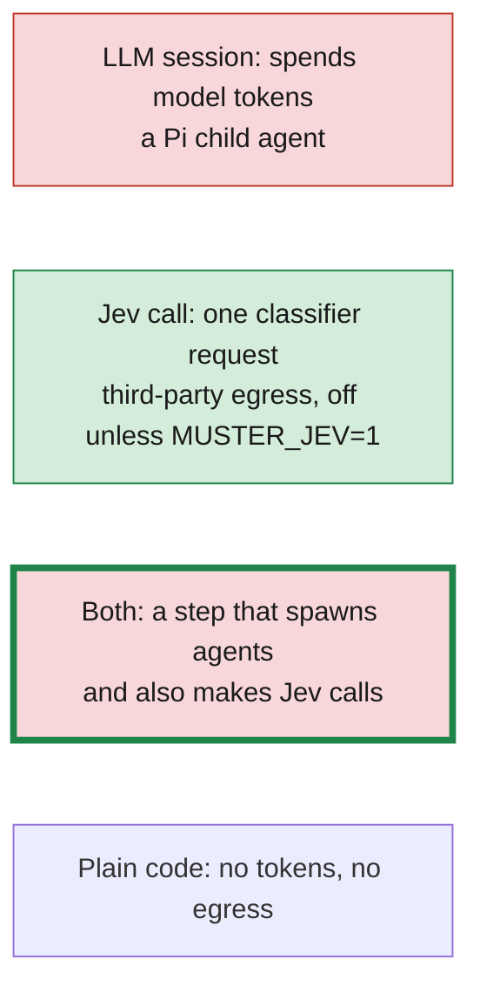

Red is an LLM session and green is a Jev call. A red node with a thick green border is a step that contains both, used in the overview diagrams where the individual calls are not drawn. Every catalogued decision is called somewhere in these diagrams; section 12 lists them in the order they fire.

Of the nine `/change` actions, `verify`, `finish` and `status` spend no tokens. `verify` runs nine deterministic gates and the test commands, and no agent is dispatched. A small-lane change with one task can start as few as two model sessions from proposal to a passing verification. The where-the-tokens-go breakdown and ways to reduce it are in [simplification.md](simplification.md).

## 1. Command surface

`registerMuster` in [src/muster/index.ts](../src/muster/index.ts) registers the `/change` command and the flags it reads from one entry point.

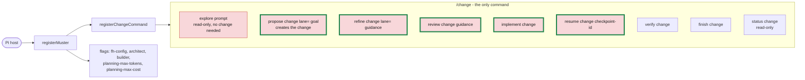

The commands `/refine`, `/implement`, `/ship`, `/os-status`, `/init` and every `/fh-*` command were removed and are not registered or aliased.

## 2. Dispatch pipeline

Every `/change` invocation runs this path. Only the handler differs between subcommands. The per-action flags come from [commands.ts](../src/change/commands.ts).

| Action | Argument shape | Change slug | Lifecycle gated | Read-only | Run identity |
| --- | --- | --- | --- | --- | --- |
| `explore` | free text (at least 1 word) | none | no | yes | none |
| `propose` | change + text | optional | no | no | per invocation |
| `refine` | change + text | required | yes | no | per invocation |
| `review` | change + text | required | yes | no | per invocation |
| `implement` | change only | required | yes | no | per change |
| `verify` | change only | required | yes | no | per change |
| `finish` | change only | required | yes | no | per change |
| `status` | change only | required | yes | yes | none |
| `resume` | change + exactly one checkpoint id | required | yes | no | per change |

```mermaid
flowchart TD
  start(["User types /change ..."]) --> reg["registered handler builds context<br/>actor, cwd, signal, sendMessage<br/>and an agent-progress observer"]
  reg --> inv["dependencies.forInvocation<br/>rebuild production deps for this cwd"]
  inv --> parse{"first word is a<br/>known action?"}
  parse -- no --> usage["notify usage line<br/>stop"]
  parse -- yes --> shape["parse remainder by argument shape<br/>free-text: whole rest is the prompt<br/>else: word 2 is the change, rest are arguments"]
  shape --> arity{"argument count within<br/>the action's arity?"}
  arity -- no --> blockedUsage["outcome: blocked<br/>summary is the action usage<br/>next: /change status change"]
  arity -- yes --> needsChange{"action needs a<br/>change slug?"}

  needsChange -- "none (explore)" --> run
  needsChange -- "optional or required" --> resolve["resolveChangeName<br/>validate slug, ask OpenSpec for status,<br/>reject slug collisions"]
  resolve --> explicit{"slug given<br/>explicitly?"}
  explicit -- yes --> found
  explicit -- no --> remembered{"active change<br/>remembered?"}
  remembered -- no --> notResolved{"change required?"}
  remembered -- yes --> found["change resolved"]
  notResolved -- yes --> blockedNone["outcome: blocked<br/>No change resolved<br/>next: /change propose change"]
  notResolved -- no --> gated

  found --> gated{"lifecycle gated?"}
  gated -- "no (propose)" --> activate
  gated -- yes --> snap["loadSnapshot<br/>OpenSpec + Git + review + validation + runtime"]
  snap --> resolveAction["resolveChangeAction<br/>explore, propose, status always allowed<br/>others need an allowed lifecycle"]
  resolveAction --> allowed{"allowed?"}
  allowed -- no --> blocker["outcome: blocked<br/>reason, blocker kind, exact next command<br/>pending checkpoint ids, stale digest, missing review.md"]
  allowed -- yes --> activate{"read-only?"}
  activate -- no --> touch["activateChange<br/>remember as the active change"]
  activate -- yes --> run
  touch --> run["createRunContext<br/>run id, models, output sink<br/>then call the action handler"]

  run --> handler["handler = one phase call<br/>see sections 4 to 11"]
  handler --> emit["emitOutcome"]
  emit --> render{"host has a<br/>message renderer?"}
  render -- yes --> panel["durable transcript panel<br/>tagged MUSTER_CUSTOM_TYPE"]
  render -- no --> toast["transient ui.notify toast"]
  handler -. "thrown error" .-> terr["terminalErrorOutcome<br/>classified failure outcome"]
  terr --> emit
```

## 3. Lifecycle

The controller derives a change's lifecycle from a `ChangeSnapshot`, never from anything a model reports. The command's allowed lifecycles are in [action-resolver.ts](../src/controller/action-resolver.ts).

| Command | Allowed lifecycles |
| --- | --- |
| `explore`, `propose`, `status` | any |
| `refine` | `PLANNING`, `REVIEW_REQUIRED`, `DESIGN_CONFLICT`, `BLOCKED` |
| `review` | `REVIEW_REQUIRED` |
| `implement` | `READY`, `IMPLEMENTING` |
| `resume` | `AWAITING_USER` |
| `verify` | `VERIFYING` |
| `finish` | `VERIFIED` |

When a command is refused, the "next" command comes from the current lifecycle: `PLANNING` and `DESIGN_CONFLICT` suggest `refine`, `REVIEW_REQUIRED` suggests `review`, `READY` and `IMPLEMENTING` suggest `implement`, `AWAITING_USER` suggests `resume`, `VERIFYING` suggests `verify`, `VERIFIED` suggests `finish`, and everything else suggests `status`.

### Derivation order

`deriveLifecycle` checks these in order and returns the first that matches.

### Transitions

Any non-terminal state can also move to `CANCELLED`. `FINISHING` and `COMPLETE` are in the transition table, but `deriveLifecycle` never returns them, because an archived change is no longer observable. `AWAITING_USER`, `DESIGN_CONFLICT`, `BLOCKED`, `FAILED` and `CANCELLED` are tracked per task and DAG branch, so unrelated branches keep running.

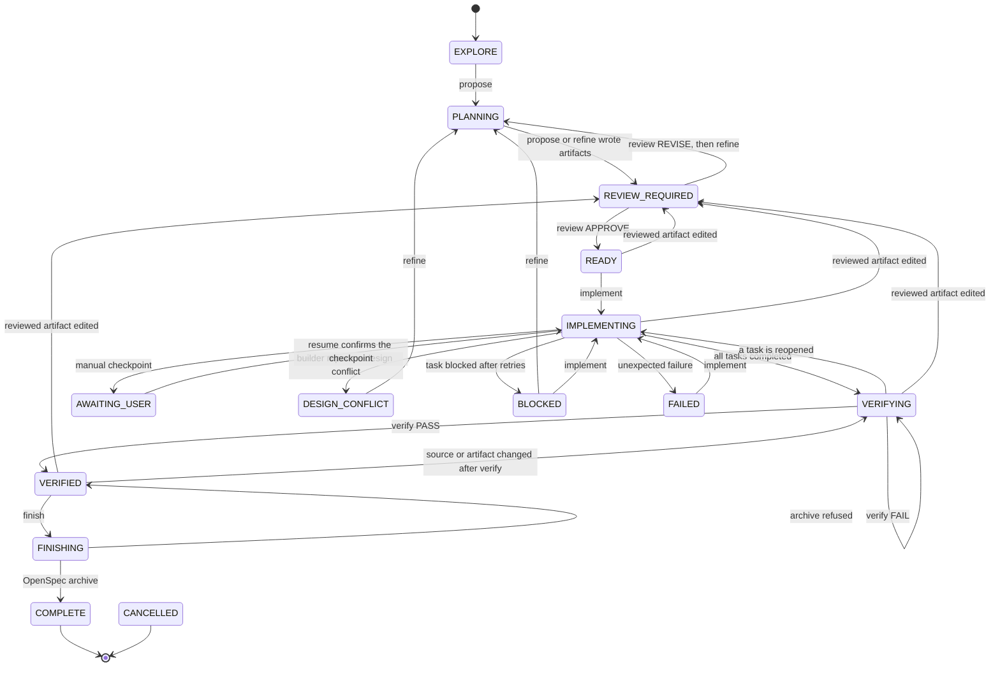

## 4. Explore

`/change explore <prompt>` investigates without creating a change or touching the lifecycle. It needs no OpenSpec change and no healthy snapshot.

## 5. Propose and refine

`/change propose <change> [lane=small|medium|large] <goal>` creates a change and its planning artifacts. `/change refine <change> [lane=...] [guidance]` revises them. Both call `runProductionPlanning` with a different phase, and both run [src/planning/run.ts](../src/planning/run.ts): choose the lane, plan in one session (after opinions and a debate on large), validate the plan in code, then render every artifact from templates.

```mermaid
flowchart TD
  a(["/change propose or refine"]) --> gate{"phase"}
  gate -- "propose (not lifecycle gated)" --> lanearg
  gate -- "refine (PLANNING, REVIEW_REQUIRED,<br/>DESIGN_CONFLICT or BLOCKED)" --> early["fetch OpenSpec status early<br/>read review.md and the current artifacts"]
  early --> rev{"latest verdict<br/>REVISE?"}
  rev -- yes --> fold["fold required changes and critical<br/>findings into the request text"]
  rev -- no --> lanearg
  fold --> lanearg

  lanearg{"lane= argument given?"} -- yes --> user["the user's lane<br/>no candidates, no judgment request"]
  lanearg -- no --> cand["retrieve up to 10 candidate files by code<br/>600 byte excerpts, denylisted files excluded"]
  cand --> pat["pattern classification over the request<br/>and the candidates sets the floor:<br/>direct and bounded are medium,<br/>architectural is large"]
  pat --> jt{"judgment enabled?"}
  jt -- no --> lane
  jt -- yes --> triage["judge change.triage<br/>disposition, four risks, mechanical, reach,<br/>two questions per candidate"]
  triage --> tv{"enforce mode<br/>and confident?"}
  tv -- "confident risk" --> up["raise the lane"]
  tv -- "every risk and the reach confident" --> down["lower it to small"]
  tv -- "already satisfied, corroborated by a candidate" --> sat["outcome: blocked<br/>no session runs"]
  tv -- no --> lane
  up --> lane
  down --> lane
  user --> lane["record the lane with the change's run records<br/>a lane only ever moves up"]

  lane --> ln{"lane"}
  ln -- "small or medium" --> plan
  ln -- large --> opin["forecast, then two specialist opinions<br/>parallel read-only sessions"]
  opin --> ob{"optional budget<br/>available?"}
  ob -- yes --> deb["one debate session over the opinions"]
  ob -- no --> plan
  deb --> plan

  plan["plan session: one read-only architect session<br/>returns a typed plan as JSON<br/>lane thinking: small and medium lower, large as configured"] --> chk["parse and validate the plan in code<br/>references resolve, ids unique, dependencies acyclic,<br/>verification executables allowed"]
  chk --> ok{"valid?"}
  ok -- no --> retry["one more plan session with the<br/>specific failures listed"]
  retry --> ok2{"valid?"}
  ok2 -- no --> fail["PLANNING_ARTIFACT_INVALID<br/>with the whole list"]
  ok2 -- yes --> disp
  ok -- yes --> disp{"plan disposition"}
  disp -- "needs_clarification or already_satisfied" --> blockq["outcome: blocked<br/>next is the specific question<br/>nothing is written"]
  disp -- plan --> norm["normalizePlan<br/>merge chained tasks with the same write scope,<br/>notes name each merge"]
  norm --> ex{"OpenSpec knows<br/>this change?"}
  ex -- no --> create["install the fusion-driven schema if missing<br/>openspec create change"]
  ex -- yes --> render
  create --> render["render proposal, one delta spec per capability,<br/>design and tasks from prompts/artifacts<br/>write them under openspec/changes/change"]
  render --> done["outcome: success on the chosen lane<br/>merge notes listed<br/>next: /change review change"]
  classDef llm fill:#f8d7da,stroke:#c0392b,color:#1a1a1a
  classDef jev fill:#d4edda,stroke:#1e8449,color:#1a1a1a
  classDef llmJev fill:#f8d7da,stroke:#1e8449,stroke-width:4px,color:#1a1a1a
  class triage jev
  class opin,deb,plan,retry llm
```

Each planning session records a usage entry in the change's run store, and the planning budget ledger (1,000,000 tokens and 1.50 USD by default, `MUSTER_PLANNING_MAX_TOKENS` and `MUSTER_PLANNING_MAX_COST_USD` or `--planning-max-tokens` and `--planning-max-cost`) is updated whether or not the session succeeded. An optional stage the budget cannot afford is skipped; the plan session is mandatory and an unaffordable one stops the command with `BUDGET_EXHAUSTED`.

## 6. Review

`/change review <change> [guidance]` approves the plan. It is only allowed in `REVIEW_REQUIRED`. Plan lint runs first on every lane; then the lane decides who approves.

```mermaid
flowchart TD
  a(["/change review change guidance"]) --> g["lifecycle gate: REVIEW_REQUIRED only"]
  g --> setup["OpenSpec status, model stack, run id,<br/>usage store, judgment runtime<br/>read the change's lane"]
  setup --> lint["plan lint in code, on every lane<br/>artifacts exist and pass strict validation,<br/>references resolve against the real specs,<br/>every scenario is cited, verification commands allowed,<br/>write scopes avoid credentials and .git,<br/>dependencies acyclic, small lane limits"]
  lint --> lf{"any error?"}
  lf -- yes --> lfail["outcome: blocked, the whole list<br/>no reviewer, no judgment request<br/>next: /change refine change"]
  lf -- no --> sem{"task list small enough<br/>to ask about, judgment enabled?"}
  sem -- no --> lanechk
  sem -- yes --> pl["judge plan.lint<br/>six task-quality concerns,<br/>findings are fixed templates filled in by code"]
  pl --> lanechk{"lane"}
  lanechk -- small --> sm{"clean and confident, or<br/>the service unavailable?"}
  sm -- yes --> lintok["write review.md: mode lint, model lint,<br/>the checks that ran, whether the semantic check ran<br/>outcome: success, no reviewer<br/>next: /change implement change"]
  sm -- "finding, uncertain concern, or over the limits" --> esc["escalate the lane to medium<br/>findings become unverified notes"]
  lanechk -- "medium or large" --> tri
  esc --> tri

  tri{"judgment enabled AND an approving review<br/>exists AND no guidance AND only the proposal<br/>or design changed?"}
  tri -- no --> disp
  tri -- yes --> jt["judge review.triage<br/>unified diffs of proposal and design"]
  jt --> carry{"immaterial edit, confident,<br/>fewer than 3 carry-forwards in a row?"}
  carry -- no --> disp
  carry -- yes --> carried["write review.md: APPROVE carried forward<br/>names basis digest, count and judged answers<br/>no reviewer runs"]
  carried --> okOut

  disp["dispatchPlanningReview<br/>fresh reviewer session, a model other than the<br/>author's preferred, else the same model,<br/>read tools only, brokered planning reviewer child"] --> parsed{"reviewer output is valid<br/>structured verdict?"}
  parsed -- yes --> after
  parsed -- no --> extract["judge review.extraction<br/>classify candidate lines of the reviewer prose<br/>extraction marked in review.md"]
  extract --> after["verdict APPROVE or REVISE<br/>critical findings, required changes, recommendations"]
  after --> same{"artifact digest unchanged<br/>while the reviewer ran?"}
  same -- no --> stale["REVIEW_ARTIFACT_INVALID"]
  same -- yes --> wr["write review.md<br/>round, mode reviewer, model, artifact digest, verdict"]
  wr --> verdict{"verdict"}
  verdict -- APPROVE --> okOut["outcome: success<br/>lifecycle becomes READY<br/>next: /change implement change"]
  verdict -- REVISE --> revise["outcome: blocked<br/>required changes listed<br/>next: /change refine change<br/>refine folds them into its prompt automatically"]
  classDef llm fill:#f8d7da,stroke:#c0392b,color:#1a1a1a
  classDef jev fill:#d4edda,stroke:#1e8449,color:#1a1a1a
  classDef llmJev fill:#f8d7da,stroke:#1e8449,stroke-width:4px,color:#1a1a1a
  class pl,jt,extract jev
  class disp llm
```

A lint approval is stale outside the small lane, so an escalation makes the next `/change review` dispatch a reviewer.

## 7. Implement and resume

`/change implement <change>` compiles `tasks.md` into a dependency DAG and runs dependency-ready tasks in a dedicated worktree. `/change resume <change> <checkpoint-id>` confirms a pause and then runs the same flow. The phase is [implementation.ts](../src/change/phases/implementation.ts); it opens the run manifest through [run-manifest.ts](../src/execution/run-manifest.ts) and hands each task to [unit-runner.ts](../src/execution/unit-runner.ts).

```mermaid
flowchart TD
  a(["/change implement change"]) --> g["lifecycle gate: READY or IMPLEMENTING"]
  r(["/change resume change checkpoint-id"]) --> rg["lifecycle gate: AWAITING_USER<br/>exactly one argument"]
  g --> load
  rg --> load

  load["OpenSpec status and apply instructions<br/>hash reviewed artifacts<br/>load and validate tasks.md"] --> tv{"every checkbox has a valid<br/>harness-task metadata block?"}
  tv -- no --> tinv["TASK_DOCUMENT_INVALID or TASK_METADATA_INVALID"]
  tv -- yes --> dag["compile task DAG from dependsOn<br/>persist under the change run store"]
  dag --> wt["ensureChangeWorktree<br/>path: sibling .muster-worktrees/repo/change-slug<br/>branch: muster/change-slug from the planning HEAD<br/>reuse only if branch and repository identity match"]
  wt --> man{"run manifest exists?"}
  man -- yes --> idc{"manifest change, repository and<br/>worktree match the selection?"}
  idc -- no --> conflict["RECOVERY_STATE_CONFLICT"]
  idc -- yes --> lref["refresh the manifest's lane<br/>from the change's lane record"]
  lref --> chg{"artifact digest differs<br/>from the manifest's?"}
  man -- no --> newm["write manifest: lifecycle READY, the lane,<br/>tasks ready or completed,<br/>model assignments, worktree identity"]
  newm --> chg
  chg -- yes --> inval["recovery action invalidate_run"]
  chg -- no --> pend["recovery actions restore_checkpoint<br/>for each pending checkpoint"]

  inval --> flow
  pend --> flow{"which command?"}
  flow -- implement --> impl["implementChange<br/>runPreparedFlow"]
  flow -- resume --> found{"checkpoint id is pending<br/>in this run?"}
  found -- no --> badresume["MANUAL_RESUME_INVALID"]
  found -- yes --> confirm["confirmManualCheckpoint<br/>records who confirmed and when"]
  confirm --> impl2["runPreparedFlow with that checkpoint<br/>removed from the pending list"]

  impl --> rf
  impl2 --> rf["runImplementationFlow"]
  rf --> rec["run recovery actions"]
  rec --> fresh{"review current AND<br/>no invalidate_run action?"}
  fresh -- no --> rreq["status review_required<br/>next: /change review change"]
  fresh -- yes --> ronly{"recovery-only actions left?<br/>wait for child or lease, review existing changes,<br/>resume task review, synchronize completion"}
  ronly -- yes --> paused0["status paused"]
  ronly -- no --> sch["runChangeScheduler<br/>see section 8 for each task"]

  sch --> res{"scheduler states"}
  res -- "a recovery decision ended a task" --> rend["escalated: the task stays ready,<br/>outcome blocked, next: /change review change<br/>stopped: outcome blocked with the reason<br/>and the failure record's path"]
  res -- "any design_conflict" --> dc["persist design_conflict on those tasks<br/>status design_conflict"]
  res -- "all completed" --> comp["status completed"]
  res -- "any awaiting_user" --> pau["status paused"]
  res -- otherwise --> blk["status blocked"]
  sch -. "any cancelled" .-> canc["manifest lifecycle CANCELLED"]

  comp --> mf["manifest lifecycle VERIFYING<br/>outcome: success<br/>next: /change verify change"]
  dc --> mf2["manifest lifecycle DESIGN_CONFLICT<br/>outcome: blocked<br/>next: /change refine change"]
  pau --> mf3["manifest lifecycle AWAITING_USER<br/>outcome: blocked, pending checkpoint kind<br/>next: /change resume change checkpoint-id"]
  blk --> mf4["manifest lifecycle BLOCKED<br/>outcome: blocked<br/>next: /change status change"]
  rreq --> out5["outcome: blocked, stale digest"]
  classDef llm fill:#f8d7da,stroke:#c0392b,color:#1a1a1a
  classDef jev fill:#d4edda,stroke:#1e8449,color:#1a1a1a
  classDef llmJev fill:#f8d7da,stroke:#1e8449,stroke-width:4px,color:#1a1a1a
  class sch llmJev
```

The scheduler runs at most one writing task at a time under a writer lease and lets read-only tasks run alongside. A task gets at most two attempts in a run; section 8 shows what ends one and what starts the second.

## 8. One task through the pipeline

This is the `execute` callback the scheduler runs for each dependency-ready task ([unit-runner.ts](../src/execution/unit-runner.ts)), with the step modules under `src/change/phases/task-steps/` and the pipeline in [task-runner.ts](../src/execution/task-runner.ts).

```mermaid
flowchart TD
  s(["scheduler picks a ready task<br/>dependencies completed"]) --> lease{"task writes files?"}
  lease -- yes --> wl["acquire the writer lease<br/>one writer at a time"]
  lease -- no --> man
  wl --> man{"task has a manual block?"}
  man -- yes --> ck["checkpointPlannedManualAction<br/>persist secret-free instructions,<br/>pause the affected DAG branch"]
  ck --> pau(["outcome awaiting_user"])
  man -- no --> t0["record attempt start time"]

  t0 --> route{"first attempt AND judgment enabled<br/>AND the lane permits reduced work?"}
  route -- no --> prim["configured builder thinking<br/>primary builder model<br/>reviewer thinking high"]
  route -- yes --> jr["judge routing.task_model<br/>one request per task, verdict carried<br/>to the builder and the reviewer"]
  jr --> lane{"enforce mode AND confident:<br/>mechanical, low risk, narrow or moderate reach?"}
  lane -- no --> prim
  lane -- yes --> eco["thinking per task: narrow gives builder low<br/>and reviewer medium, moderate gives medium and high<br/>economy models only where configured:<br/>MUSTER_BUILDER_ECONOMY_MODEL<br/>MUSTER_REVIEWER_ECONOMY_MODEL"]

  prim --> b
  eco --> b["fresh builder session<br/>brokered child in the change worktree<br/>declared scopes in the prompt<br/>the latest failure record, when there is one<br/>8 hour timeout"]
  b --> cc["each brokered host command:<br/>rules, allowlist, profile, then<br/>judge command.classification with a 1.5 second bound"]
  cc --> claim{"builder claim"}
  claim -- blocked --> ob["evaluateTaskOutcome: blocked<br/>needs a reason"]
  claim -- design_conflict --> odc["evaluateTaskOutcome: design_conflict<br/>needs evidence, artifacts, affected tasks<br/>invalidates the planning review"]
  claim -- completed --> tdd{"TDD policy: behavior-changing task<br/>has failing-test-first evidence?"}
  tdd -- no --> tb["blocked: TDD evidence rejected"]
  tdd -- yes --> vb["forecast validation budget"]
  vb --> ver["run task.verify commands in the worktree<br/>host runner, verification profile<br/>bun, node, npm, npx, git, openspec only<br/>no shell operators, 120 second cap<br/>stop at the first non-zero exit"]
  ver --> vp{"all passed?"}
  vp -- no --> vf["not completed: verification failed"]
  vp -- yes --> jf["judge review.task_focus<br/>diff excerpt up to 24,000 bytes,<br/>skipped when a changed path is denylisted"]
  jf --> sk{"enforce mode, every answer confidently good,<br/>lane permits reduction, verification passed,<br/>TDD accepted, diff complete and in write scope,<br/>none denylisted, first attempt?"}
  sk -- yes --> skip["review skipped:<br/>review record APPROVE, model skipped,<br/>basis judgment, the decision record id"]
  sk -- no --> rv["fresh read-only reviewer child<br/>contract, diff, test output, scopes, TDD evidence<br/>focus items only when enforce mode acted<br/>120 second timeout"]
  rv --> ap{"approved?"}
  ap -- no --> rp["blocked: findings become repair input"]
  ap -- yes --> pe
  skip --> pe["persistEvidence<br/>task-results, reviews/task, tdd, reports"]
  pe --> sync["tick the checkbox in tasks.md<br/>update manifest for this task"]
  sync --> rec["reconcile first-attempt outcome into<br/>the routing decision record"]
  rec --> done(["outcome completed"])

  ob --> fr
  tb --> fr
  vf --> fr
  rp --> fr["write the failure record: outcome, evidence,<br/>reproduction, stated fix, changed paths<br/>bounded, redacted, two latest kept"]
  fr --> tr["judge task.recovery once<br/>retry, escalate or stop"]
  tr --> rd{"enforce mode AND confident?"}
  rd -- "retry, verification failed or repairs required,<br/>and a second attempt is left" --> again
  rd -- escalate --> escl["escalateLane, refresh the manifest lane<br/>the task stays ready<br/>command ends blocked, next: /change review"]
  rd -- stop --> stp["command ends blocked with the reason<br/>and the failure record's path"]
  rd -- "otherwise, or judgment off, unavailable,<br/>uncertain or shadow" --> stuck(["outcome blocked<br/>dependents on this branch are blocked,<br/>unrelated branches continue<br/>a later /change implement runs it again<br/>with the failure in the builder prompt"])
  odc --> dcend(["outcome design_conflict"])

  t0 -. "any step throws:<br/>unparseable builder JSON, child crash, git error" .-> tf["failure record, then task.recovery once"]
  tf --> thr{"decision ends the task?"}
  thr -- yes --> stp
  thr -- no --> att{"attempt below 2?"}
  att -- yes --> again["second attempt<br/>primary builder and configured thinking,<br/>never an economy lane<br/>the reviewer runs, it is never skipped"]
  again --> t0
  att -- no --> dbg(["outcome debugging<br/>lifecycle BLOCKED"])
  classDef llm fill:#f8d7da,stroke:#c0392b,color:#1a1a1a
  classDef jev fill:#d4edda,stroke:#1e8449,color:#1a1a1a
  classDef llmJev fill:#f8d7da,stroke:#1e8449,stroke-width:4px,color:#1a1a1a
  class jr,cc,jf,tr jev
  class b,rv llm
```

Without judgment a returned `blocked` outcome (the builder claimed it, TDD evidence was rejected, verification failed, or the reviewer asked for repair) is final for that run, and only a thrown attempt is retried. Every failed attempt is still recorded, so the next attempt starts informed. With judgment in enforce mode `task.recovery` can add the second attempt to a blocked task, never a third.

## 9. Verify

`/change verify <change>` runs final verification. It is only allowed in `VERIFYING`, which is the state after every task is checked and before a current validation exists. No agent runs here: `runFinalValidation` opens a fresh session identity but every gate is a check over recorded evidence and command results.

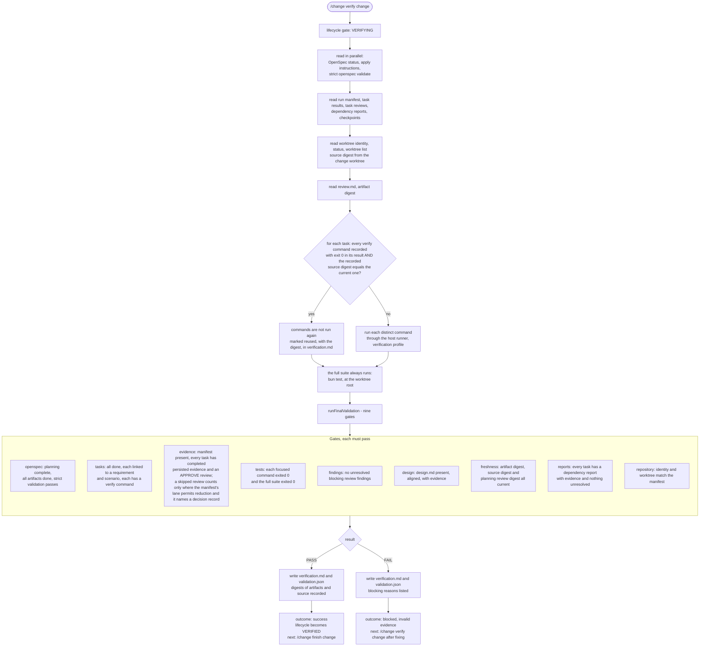

## 10. Finish

`/change finish <change>` never runs automatically after verification. It confirms the recorded verification is still current and hands archiving to OpenSpec.

Archiving does not merge the change branch. The implementation stays on `muster/<change>` in the sibling worktree until you merge or discard it.

## 11. Status

`/change status [change]` is read-only. It does not remember the change as active.

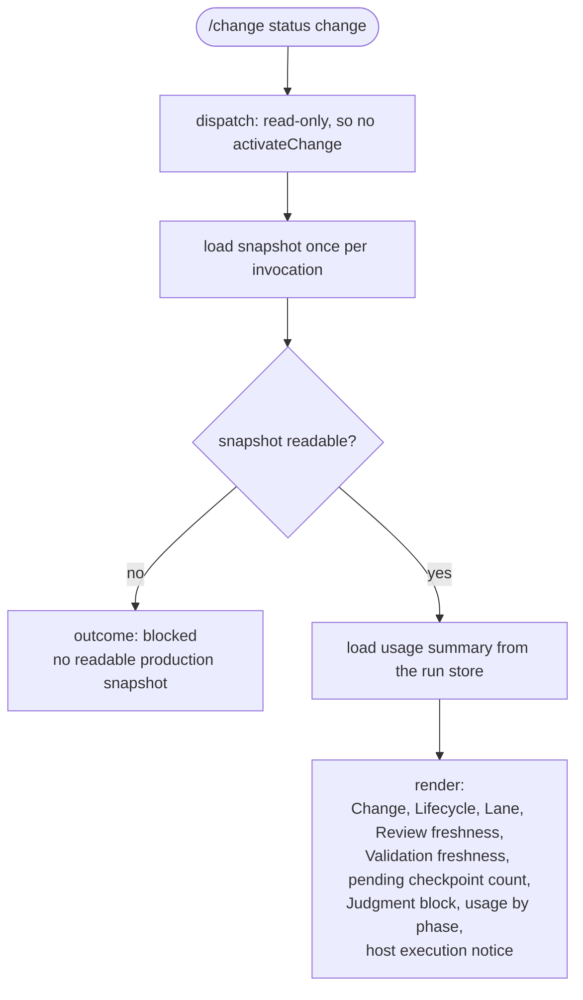

## 12. Judgment runtime

Every judgment call site goes through the same runtime in [src/judgment/ask.ts](../src/judgment/ask.ts), and every site that can act asks through `tryJudge`, which returns nothing to use when judgment is off or unavailable. Judgment is enabled by `MUSTER_JEV=1` and `MUSTER_JEV_API_KEY`, and once enabled it enforces by default; `MUSTER_JEV_MODE=shadow` selects shadow. With judgment off, nothing is sent and behavior is exactly what it is without it. No decision has its own enabling flag.

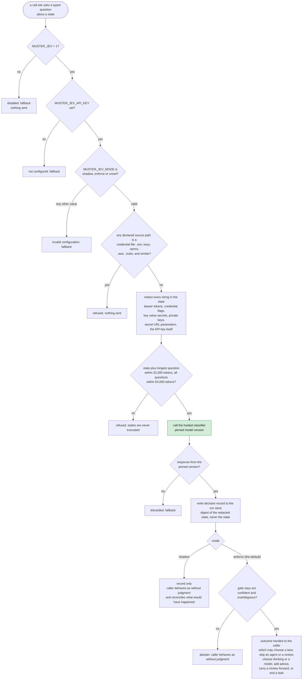

The call sites, in the order they fire during a change:

| Order | Decision | Where | Can change behavior in enforce mode |
| --- | --- | --- | --- |
| 1 | `change.triage` | propose, refine, unless `lane=` is given | yes: chooses the lane, or ends the command when the request is already satisfied |
| 2 | `plan.lint` | review, after deterministic lint passes | yes: approves a small-lane plan without a reviewer, or escalates it |
| 3 | `review.triage` | review, when an approved review exists and only the proposal or design changed | yes: can carry an approval forward |
| 4 | `review.extraction` | review, only for unstructured reviewer output | yes: extracts findings |
| 5 | `routing.task_model` | implement, first attempt, when the lane permits reduced work | yes: thinking per task, and the economy models where configured |
| 6 | `command.classification` | implement, every brokered host command | yes: a non-none category denies the command |
| 7 | `review.task_focus` | implement, before each task review | yes: adds focus, or skips the review when every guard holds |
| 8 | `task.recovery` | implement, after a failed attempt | yes: retry once more, escalate the lane, or stop for a person |

The [security model](security.md) lists what each call site sends.
