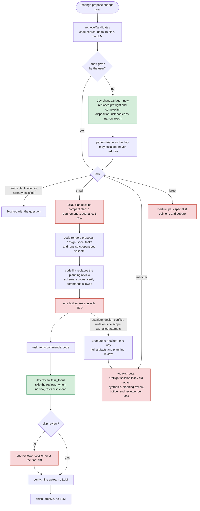

# Where the tokens go, and where to simplify

This is a review of the `/change` pipeline as it is coded today, not a plan of record. Colors follow the [legend in command-flow.md](command-flow.md#how-to-read-the-diagrams): red is an LLM session, green is a Jev call. Counts are minimum sessions read from the code, not measurements. No token or cost figures exist for a real run yet.

## Short answer

Yes, a triage step should come first, and half of one already exists. Today it does not save anything, for three reasons:

1. **It runs too late.** `planning.complexity` fires after the preflight LLM session, because it needs that session's evidence paths ([planning.ts](../src/change/phases/planning.ts)). By then the first agent has already run.
2. **It only steers planning.** `classifyChange` decides whether specialist opinions and a debate run (architectural only) and which thinking level planning uses. Everything after planning is identical for every size.
3. **The heavy parts are hard-coded.** `orchestrationPolicy` returns `independentReview: true`, `finalValidation: true` and `tests: true` for every classification ([complexity-router.ts](../src/controller/complexity-router.ts)). A one-line rename and a cross-cutting migration get the same review, builder and reviewer sessions per task.

So a small change and a medium change cost the same. The classifier separates them and then throws the distinction away.

## Where the tokens go today

Sessions per command for a small two-task change on the default route. Each is a separate Pi child process that starts with an empty context.

| Command | LLM sessions | Notes |
| --- | --- | --- |
| `explore` | 1 | Architect at its configured thinking level. Optional. |
| `propose`, `refine` | 2, or 3 after a bad bundle | One preflight session (read-only, at most 6 tool calls, low thinking) and one synthesis session. Synthesis returns all four artifacts as one escaped JSON string, and a parse failure regenerates the whole thing once. Architectural changes add at least two opinion sessions and one debate session. |
| `review` | 1 | A fresh reviewer reading artifacts that another session just wrote. |
| `implement`, `resume` | 2 per task | A fresh builder with full tools, then a fresh reviewer with thinking fixed at `high`. A second builder attempt only if an attempt throws. |
| `verify` | 0 | Nine code gates and the test commands. No agent is dispatched. |
| `finish`, `status` | 0 | |

A two-task small change therefore costs at least 2 + 1 + 4 = 7 sessions, before any retry, and every session re-reads the repository from scratch.

Jev calls are separate from that: eight decisions are wired, each a single classifier request rather than an agent session. They are cheap per call, but `planning.preflight` and `planning.complexity` both send repository material about the same request, and `planning.preflight` is the largest egress the layer has.

## The proposal: triage first, three lanes

Move the size decision to the front of `propose`, make it one Jev call, and let it choose how much ceremony follows. The pieces already exist: `retrieveCandidates` is code with no LLM, `patternRiskInputs` is a free baseline, and the complexity and routing decisions already ask about contract, migration, security boundary, ambiguity, mechanical work and narrow reach.

| | Small | Medium | Large |
| --- | --- | --- | --- |
| Chosen when | At most 2 files, 1 capability, and no public-contract, migration, security-boundary or ambiguity signal. This is what `classifyChange` calls `direct`. | Anything else that is contained. Also the answer whenever triage is unavailable or unsure. | Cross-cutting, migration, security boundary or design ambiguity. This is today's `architectural`. |
| Planning | One session, code renders the artifacts | Preflight session unless Jev acted, then synthesis | Medium plus opinions and debate |
| Planning review | Code lint, no reviewer | One reviewer session | One reviewer session |
| Build and review | One task, one builder, one reviewer unless Jev says skip | Builder and reviewer per task | Builder and reviewer per task |
| Verify and finish | Unchanged | Unchanged | Unchanged |
| LLM sessions for the two-task example | 2 to 3 | 7 | 10 or more |

Rules that keep it safe:

- **Deterministic gates never depend on the lane.** TDD evidence, focused verification, digest freshness, the writer lease, manual checkpoints, the credential-file denylist and the nine final gates stay as they are. A lane removes LLM sessions, not checks. `orchestrationPolicy` should split its `mandatory` block into checks that are always on and reviews that depend on the lane.
- **Only the expensive direction is guarded.** The complexity decision already declares `effects: ["adds_caution", "reduces_work"]`, and a confident enforce-mode answer is the only thing allowed to reduce work. Keep that. Without Jev, pattern triage can hold at medium or escalate to large, and small is reachable only through an explicit `lane=small`.
- **Shadow first.** In `shadow` mode, record the lane that would have been chosen and route nothing, exactly as model routing does today. Compare records against how the changes actually went before enforcing.
- **Escalation is one-way and mid-flight.** A design conflict, a write outside the declared scopes, or two failed attempts stops the small lane and promotes the change to medium. The lane is stored in the run manifest so the final gates know which checks apply.
- **One Jev call, not two.** `planning.preflight` and `planning.complexity` become one decision with one egress. That also removes the largest single planning egress from a second request.

The one real design decision is planning review. The README calls independent review a core guarantee, and the small lane replaces the LLM reviewer with a code lint. That is defensible for a change whose whole plan is one requirement, one scenario and one task, but it is your call.

## Other places to simplify

Ordered by tokens saved per unit of effort.

| # | Change | Saves | Why it is cheap or hard |
| --- | --- | --- | --- |
| 1 | Lane-aware policy (above) | 4 to 5 sessions on a small change | The biggest win. Touches the policy, the manifest and the gates. |
| 2 | Merge tasks that share a write scope and form a `dependsOn` chain into one builder session when the DAG compiles | A builder and a reviewer per merged task | Small. The test job in [e2e-chain-test.md](e2e-chain-test.md) is the example: `1.1` and `1.2` write the same two files, so the second session re-reads what the first just wrote. Also tell the planner to prefer one task per cohesive file set. |
| 3 | Stop returning artifacts as one escaped JSON string | Output tokens on every plan, plus the retry | Have the session write files through the write tool inside the change root, or return a compact plan and render Markdown in code. A single bad quote today regenerates all four artifacts. |
| 4 | Fold the preflight session into synthesis for the medium lane | One session | Both explore the same code. Let synthesis return either a disposition or the artifacts. The early stop for an already-satisfied request survives. |
| 5 | One review over the final diff instead of one per task, unless `review.task_focus` flags risk | A reviewer session per task | Medium effort: the review record and evidence are per task today. |
| 6 | Reuse a task's verification evidence at `verify` when the source digest is unchanged | Time, not tokens | Verify currently reruns every task's commands and then the full suite. |
| 7 | A `/change run` driver that chains review, implement and verify, stopping at a checkpoint, a block or a failure, and leaving `finish` explicit | Human steps: about seven commands become two | The lifecycle already names the next command at every step. |
| 8 | Remove `/refine`, `/implement` and `/ship` after the beta, and shrink `/fh-*` to diagnostics | The costliest and least governed paths | The legacy handlers run multi-slot debates and collaborations outside the budget forecasts and the lifecycle gates. |
| 9 | Prune the Jev portfolio to decisions that save tokens or protect | Complexity, not tokens | Keep preflight and complexity (merged into triage), review triage, routing, task focus and command classification. `planning.task_quality` and `review.extraction` are advice or repair and can be replaced by a retry until the shadow records show they earn their place. The two unwired decisions can wait. |

## What not to simplify

The lifecycle derivation, the action gates, digest freshness, the writer lease, the change worktree, manual checkpoints, the run store and the nine final gates spend no tokens. They are why a model's claim is never taken as evidence, and they are the reason a small lane can be trusted. Their cost is code, not sessions.

## Decisions taken

1. A code lint is an acceptable replacement for the LLM planning review on the small lane. A Jev check of the six task-quality concerns sits on top of it, and any doubt escalates to the reviewer.
2. Every lane writes OpenSpec artifacts. There is no quick command that bypasses OpenSpec.
3. Commands stay deliberate steps. There is no `/change run` driver, and escalation ends a command with the next command named rather than running the reviewer by itself.
4. Old records are not migrated. This is a beta, so schema versions are bumped and runs from before the series are not resumed across it.
5. Jev acts in enforce mode by default once `MUSTER_JEV=1` and a key are set. The per-decision enabling variables are removed.
6. Tests use a scripted judgment client instead of recorded fixtures, plus a manual probe against the live service.
7. Task merging is done in code. Jev is used for triage, plan lint, review skipping, per-task thinking, and retry, escalate or stop.
8. The whole old Fusion Harness extension is removed, including every `/fh-*` command.

## The plan

Seven OpenSpec changes, in order. Each has a proposal, design, specs and a task list with dependencies, scopes and verification commands, so the harness can implement them itself.

| # | Change | What it does |
| --- | --- | --- |
| 1 | [simplify-01-retire-legacy-surface](../openspec/changes/simplify-01-retire-legacy-surface/proposal.md) | Removes the old extension and every legacy command, moves shared runtime into `src/`, collapses four spawn layers into one, deletes four unwired modules, adds a guard against unwired code. |
| 2 | [simplify-02-prompt-files](../openspec/changes/simplify-02-prompt-files/proposal.md) | Moves every agent prompt and every Jev question into template files with declared variables, proved byte-identical by goldens. |
| 3 | [simplify-03-judgment-core](../openspec/changes/simplify-03-judgment-core/proposal.md) | One module per decision, one call-site helper, a scripted client instead of fixtures, enforce by default, no per-decision flags, capsule ranking and seven report modules deleted. |
| 4 | [simplify-04-triage-lanes](../openspec/changes/simplify-04-triage-lanes/proposal.md) | Lanes, a merged Jev triage decision that runs before any agent, the `lane=` argument, a declared lane policy table. |
| 5 | [simplify-05-structured-planning](../openspec/changes/simplify-05-structured-planning/proposal.md) | A typed plan validated and rendered by code, no preflight session, plan lint, the small lane approved without a reviewer when nothing is wrong. |
| 6 | [simplify-06-lean-execution](../openspec/changes/simplify-06-lean-execution/proposal.md) | Task merging, review skipping, thinking per task, failure records with a retry, escalate or stop decision, verification reuse, a split implementation phase. |
| 7 | [simplify-07-closeout](../openspec/changes/simplify-07-closeout/proposal.md) | Empty allowlists, size and session budgets as tests, documentation checks, refreshed docs and the end-to-end job. |

Measured figures from a real run go here after the manual acceptance step in the last change's README.

